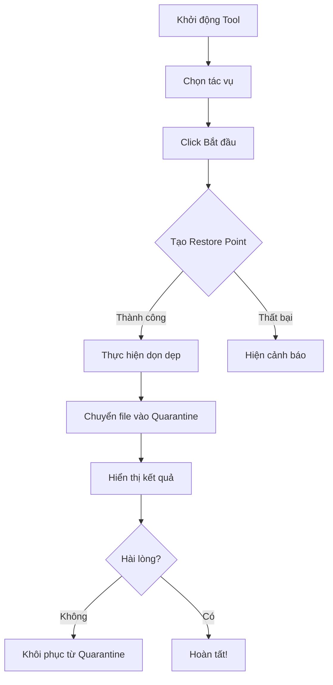

<div align="center">

# 🧹 WindowsCleanupTool v2.0

**Công Cụ Dọn Dẹp & Tối Ưu Windows Chuyên Nghiệp**

<p align="center">
  
  
  
  
</p>

[🚀 Bắt Đầu Nhanh](#-bắt-đầu-nhanh) • [✨ Tính Năng](#-tính-năng) • [📥 Tải Về](#-tải-về--cài-đặt) • [📖 Tài Liệu](#-tài-liệu) • [🤝 Đóng Góp](#-đóng-góp)


</div>

---

## 📋 Mục Lục

- [Giới Thiệu](#-giới-thiệu)
- [Tính Năng](#-tính-năng)
- [Yêu Cầu Hệ Thống](#-yêu-cầu-hệ-thống)
- [Tải Về & Cài Đặt](#-tải-về--cài-đặt)
- [Bắt Đầu Nhanh](#-bắt-đầu-nhanh)
- [Điểm Nổi Bật](#-điểm-nổi-bật)
- [Hệ Thống An Toàn](#️-hệ-thống-an-toàn)
- [Hệ Thống Plugin](#-hệ-thống-plugin)
- [Hướng Dẫn Sử Dụng](#-hướng-dẫn-sử-dụng)
- [Tài Liệu](#-tài-liệu)
- [Câu Hỏi Thường Gặp](#-câu-hỏi-thường-gặp)
- [Xử Lý Sự Cố](#️-xử-lý-sự-cố)
- [Đóng Góp](#-đóng-góp)
- [Lịch Sử Phiên Bản](#-lịch-sử-phiên-bản)
- [Giấy Phép](#-giấy-phép)
- [Tác Giả](#-tác-giả)

---

## 🌟 Giới Thiệu

**WindowsCleanupTool** là công cụ bảo trì hệ thống mạnh mẽ, an toàn và dễ sử dụng, được thiết kế cho Windows 10/11. Công cụ kết hợp các tính năng tốt nhất của CCleaner, BleachBit và các script tối ưu tùy chỉnh thành một giải pháp duy nhất, **miễn phí** và **mã nguồn mở**. 

### 🎯 Tại Sao Chọn WindowsCleanupTool? 

- ✅ **100% Miễn Phí & Mã Nguồn Mở** - Không có chi phí ẩn, không theo dõi người dùng
- 🛡️ **An Toàn Tuyệt Đối** - Bảo vệ file hệ thống + cơ chế hoàn tác trong 7 ngày
- 🚀 **Hiệu Suất Cao** - Giải phóng 2-5 GB dung lượng chỉ trong vài phút
- 🔌 **Mở Rộng Dễ Dàng** - Kiến trúc plugin cho phép tùy chỉnh
- 🌍 **Hỗ Trợ Tiếng Việt** - Giao diện và tài liệu 100% tiếng Việt
- 🧪 **Đã Kiểm Thử** - Tự động kiểm tra + quy trình CI/CD chuyên nghiệp

---

## ✨ Tính Năng

### 🧹 Dọn Dẹp Cơ Bản

- **File Tạm** - Xóa file tạm Windows & người dùng (~1-3 GB)
- **Cache Trình Duyệt** - Dọn Chrome, Edge, Firefox (~500 MB-2 GB)
- **Thùng Rác** - Làm sạch thùng rác an toàn
- **Cache Windows Update** - Xóa file cập nhật đã tải (~500 MB-1 GB)
- **Cache Thumbnail** - Xóa ảnh xem trước Windows (~100-500 MB)
- **File Prefetch** - Dọn thư mục prefetch
- **Cache Font** - Xây dựng lại cache font
- **Event Logs** - Xóa nhật ký sự kiện Windows

### ⚙️ Dọn Dẹp Nâng Cao

- **Dọn WinSxS** - Dọn sâu component store (~1-2 GB)
- **CompactOS** - Nén file hệ thống (tiết kiệm 2-4 GB)
- **File Ngủ Đông** - Tắt chế độ hibernation (tiết kiệm ~dung lượng RAM)
- **Reset Microsoft Store** - Xóa cache Store
- **Cache OneDrive** - Dọn file tạm OneDrive
- **File Tải Cũ** - Xóa file cũ trong thư mục Downloads

### 🚀 Tối Ưu Hiệu Suất

- **Tối Ưu Khởi Động** - Giảm thời gian boot
- **Tối Ưu Dịch Vụ** - Tắt dịch vụ không cần thiết
- **Tối Ưu Page File** - Điều chỉnh bộ nhớ ảo
- **Hiệu Ứng Hình Ảnh** - Giảm animation để tăng tốc
- **Chế Độ Hiệu Suất Cao** - Kích hoạt power plan tối đa
- **Tắt Game DVR** - Tăng FPS trong game
- **Tối Ưu Windows Search** - Cải thiện tốc độ tìm kiếm

### 🔒 Bảo Mật & Riêng Tư

- **Kiểm Tra Tường Lửa** - Đảm bảo Windows Firewall đang bật
- **Chống Phần Mềm Rác** - Bật chặn ứng dụng không mong muốn (PUA)
- **Quét Virus Nhanh** - Chạy Windows Defender quick scan
- **Tắt SMBv1** - Vô hiệu hóa giao thức SMB không an toàn
- **Tắt Telemetry** - Ngừng thu thập dữ liệu Windows
- **ID Quảng Cáo** - Tắt theo dõi quảng cáo
- **Cortana & Copilot** - Tắt trợ lý AI
- **Mic & Camera** - Kiểm soát quyền riêng tư phần cứng toàn hệ thống
- **Lịch Sử Hoạt Động** - Xóa dữ liệu Windows Timeline

### 🔧 Tiện Ích

- **Dọn Registry** - Quét & sửa lỗi registry
- **Tìm File Trùng** - Tìm và xóa file trùng lặp (hash MD5)
- **Gỡ Cài Đặt Nâng Cao** - Xóa hoàn toàn ứng dụng (bao gồm file thừa)
- **Kiểm Tra Ổ Cứng** - Xem tình trạng ổ cứng vật lý (SMART)
- **Hỗ Trợ Từ Xa** - Tắt/bật remote desktop
- **Hiện Đuôi File** - Bật hiển thị phần mở rộng file

### 📊 Bảng Điều Khiển Sức Khỏe

Giám sát hệ thống thời gian thực:

- **Sử Dụng CPU** - Tải xử lý hiện tại
- **Sử Dụng RAM** - Mức tiêu thụ bộ nhớ
- **Dung Lượng Ổ Đĩa** - Không gian trống trên ổ C:
- **Kích Thước File Tạm** - Dung lượng file tạm hiện tại
- **Số App Khởi Động** - Số chương trình tự động chạy
- **Điểm Sức Khỏe** - Đánh giá tổng thể (0-100)

---

## 💻 Yêu Cầu Hệ Thống

| Yêu Cầu | Tối Thiểu | Khuyến Nghị |
|---------|-----------|-------------|
| **Hệ Điều Hành** | Windows 10 (64-bit) | Windows 11 (mới nhất) |
| **PowerShell** | 5.1 | 7.x |
| **.NET Framework** | 4. 7.2 | 4.8 |
| **RAM** | 2 GB | 4 GB+ |
| **Dung Lượng Ổ Cứng** | 50 MB | 100 MB |
| **Quyền** | Administrator | Administrator |

---

## 📥 Tải Về & Cài Đặt

### Phương Pháp 1: Tải File ZIP (Khuyến Nghị)

1. **Tải về** phiên bản mới nhất:
   ```
   https://github.com/hoangduc981998/WindowsCleanupTool/archive/refs/heads/main.zip
   ```

2.  **Giải nén** file ZIP vào một thư mục (ví dụ: `C:\CleanupTool`)

3.  **Chạy** file `Start_CleanUp.bat` (chuột phải → Run as Administrator)

### Phương Pháp 2: Clone Qua Git

```bash
git clone https://github.com/hoangduc981998/WindowsCleanupTool.git
cd WindowsCleanupTool
.\Start_CleanUp.bat
```

### Phương Pháp 3: Chạy Trực Tiếp PowerShell

```powershell
# Tải và chạy trong một lệnh
iex ((New-Object Net.WebClient). DownloadString('https://raw.githubusercontent.com/hoangduc981998/WindowsCleanupTool/main/CleanUpTool.ps1'))
```

---

## 🚀 Bắt Đầu Nhanh

### Bước 1: Khởi Động

**Cách A:** Double-click file `Start_CleanUp.bat`  
**Cách B:** Chuột phải vào `CleanUpTool.ps1` → "Run with PowerShell"

### Bước 2: Chọn Tác Vụ

Chuyển đến tab **"Dọn Dẹp Cơ Bản"**:

- ☑️ Dọn thư mục Temp
- ☑️ Xóa cache trình duyệt
- ☑️ Dọn Thùng rác
- ☑️ Dọn Windows Update Cache
- ☑️ Dọn thumbnail cache

### Bước 3: Thực Hiện Dọn Dẹp

Click nút **"BẮT ĐẦU THỰC HIỆN"**

Công cụ sẽ:
1. ✅ Tạo điểm khôi phục hệ thống (System Restore Point)
2. ✅ Ước tính dung lượng sẽ giải phóng (~2-5 GB)
3. ✅ Thực thi các tác vụ dọn dẹp
4. ✅ Hiển thị kết quả trong LogBox

### Bước 4: Kiểm Tra Kết Quả

- Xem file **Desktop\CleanupTool_[ngày]. log** để biết chi tiết
- Kiểm tra dung lượng ổ đĩa đã tăng trong File Explorer
- File đã xóa được lưu trong Quarantine 7 ngày (có thể khôi phục)

---

## 🎨 Điểm Nổi Bật

### 🛡️ Hệ Thống An Toàn

**Thư Mục Được Bảo Vệ** (Không bao giờ xóa):
```
C:\Windows\System32
C:\Program Files
C:\Users\[Bạn]\Documents
C:\Users\[Bạn]\Pictures
C:\Users\[Bạn]\Desktop
```

**Định Dạng File Được Bảo Vệ**:
```
. sys, .dll, .exe, .ini, .inf
```

**Phát Hiện File Đang Dùng** - File đang mở sẽ tự động bị bỏ qua

### 📦 Hệ Thống Quarantine (Cách Ly)

Tất cả file đã xóa được lưu trữ **7 ngày**:

**Vị Trí:**
```
%LOCALAPPDATA%\CleanupTool\Quarantine\
```

**Cấu Trúc:**
```
Quarantine/
├── 20251201_120000/
│   ├── abc123-file.tmp
│   └── abc123-file.tmp.meta. json
└── 20251201_150000/
    └── ... 
```

**Khôi Phục File:**
```powershell
Restore-FromQuarantine -QuarantinePath "C:\Users\.. .\Quarantine\.. .\file.tmp"
```

### 🔌 Hệ Thống Plugin

**Plugin Có Sẵn:**

| Plugin | Ứng Dụng | Mục Tiêu | Dung Lượng Dự Kiến |
|--------|----------|----------|-------------------|
| **Spotify** | Spotify Desktop | Cache `*. file` | ~500 MB |
| **Discord** | Discord Desktop | Thư mục Cache | ~300 MB |
| **Steam** | Steam Client | Cache tải xuống | ~2 GB |
| **VSCode** | Visual Studio Code | Logs, CachedData (>7 ngày) | ~200 MB |

**Tạo Plugin Tùy Chỉnh:**

```powershell
# 1. Copy template
Copy-Item PluginTemplate.ps1 Plugins/Plugin_MyApp.ps1

# 2.  Implement 4 hàm bắt buộc:
function Get-PluginMetadata { ...  }
function Get-CleanupTargets { ... }
function Invoke-PluginCleanup { ... }
function Get-EstimatedSpace { ... }

# 3.  Khởi động lại tool - plugin tự động load! 
```

Xem [Hướng Dẫn Phát Triển Plugin](Plugins/README.md) để biết chi tiết. 

---

## 📚 Hướng Dẫn Sử Dụng

### Quy Trình Cơ Bản



### Tổng Quan Các Tab

| Tên Tab | Mục Đích | Mức Độ Rủi Ro |
|---------|----------|----------------|
| **Dọn Dẹp Cơ Bản** | Dọn dẹp cơ bản (temp, cache) | 🟢 An toàn |
| **Nâng Cao** | Dọn dẹp nâng cao (WinSxS, hibernation) | 🟡 Cẩn thận |
| **Tối Ưu** | Tối ưu hiệu suất | 🟢 An toàn |
| **Bảo Mật** | Tăng cường bảo mật | 🟢 An toàn |
| **Riêng Tư** | Kiểm soát quyền riêng tư | 🟢 An toàn |
| **Cập Nhật App** | Cập nhật ứng dụng qua Winget | 🟢 An toàn |
| **Tiện Ích** | Tiện ích (gỡ cài đặt, registry) | 🟡 Cẩn thận |
| **Registry** | Dọn dẹp registry | 🟡 Cẩn thận |
| **File Trùng** | Tìm file trùng lặp | 🟡 Cẩn thận |
| **Gỡ Cài Đặt** | Gỡ ứng dụng nâng cao | 🟡 Cẩn thận |

### Lịch Dọn Dẹp Khuyến Nghị

- **Hàng Tuần:** Dọn Dẹp Cơ Bản (Temp, Cache, Thùng rác)
- **Hàng Tháng:** Dọn Dẹp Nâng Cao (WinSxS, Windows Update Cache)
- **Hàng Quý:** Dọn Toàn Diện + Quét Registry + Tìm File Trùng

---

## 📖 Tài Liệu

- **[Hướng Dẫn Người Dùng](HUONG_DAN_SU_DUNG.md)** - Hướng dẫn từng bước cho người dùng cuối
- **[Tài Liệu Kỹ Thuật](DOCUMENTATION.md)** - Tài liệu tham khảo cho developer
- **[Lịch Sử Phiên Bản](CHANGELOG.md)** - Lịch sử cập nhật và ghi chú phát hành
- **[Phát Triển Plugin](Plugins/README.md)** - Hướng dẫn tạo plugin tùy chỉnh

---

## ❓ Câu Hỏi Thường Gặp

### Câu Hỏi Chung

**H: WindowsCleanupTool có an toàn không?**  
Đ: Hoàn toàn an toàn!  Phiên bản v2.0 bao gồm:
- Xác thực thư mục được bảo vệ
- Xác thực định dạng file được bảo vệ
- Phát hiện file đang sử dụng
- Hệ thống quarantine 7 ngày (có thể hoàn tác)
- Tạo System Restore Point trước khi dọn dẹp

**H: Tôi có cần cài đặt gì không?**  
Đ: Không cần cài đặt.  Chỉ cần tải về, giải nén và chạy `CleanUpTool.ps1`. 

**H: Khác gì so với CCleaner? **  
Đ:
- ✅ 100% miễn phí & mã nguồn mở (CCleaner Free có quảng cáo)
- ✅ Không theo dõi người dùng (CCleaner thu thập dữ liệu)
- ✅ Hệ thống Quarantine (CCleaner xóa vĩnh viễn)
- ✅ Kiến trúc plugin mở (CCleaner đóng)
- ✅ Giao diện tiếng Việt ưu tiên

**H: Có thể giải phóng bao nhiêu dung lượng?**  
Đ: Kết quả thông thường:
- Dọn nhẹ: 500 MB - 2 GB
- Dọn tiêu chuẩn: 2 GB - 5 GB
- Dọn sâu (CompactOS + WinSxS): 4 GB - 10 GB

### An Toàn & Khôi Phục

**H: File đã xóa đi đâu?**  
Đ: File được chuyển vào Quarantine tại `%LOCALAPPDATA%\CleanupTool\Quarantine\` trong 7 ngày.

**H: Làm sao để khôi phục file đã xóa?**  
Đ:
1. Mở `C:\Users\[Bạn]\AppData\Local\CleanupTool\Quarantine\`
2. Tìm thư mục có timestamp (ví dụ: `20251201_140530`)
3. Tìm file của bạn và copy về vị trí cũ

**H: Tôi có thể tắt Quarantine không?**  
Đ: Không khuyến nghị, nhưng có thể - sửa hàm `Move-ToQuarantine` trong `CleanUpTool.ps1`. 

### Xử Lý Sự Cố

**H: Lỗi "Execution Policy" khi chạy file . ps1?**  
Đ: Chạy lệnh này trong PowerShell với quyền Administrator:
```powershell
Set-ExecutionPolicy -ExecutionPolicy RemoteSigned -Scope CurrentUser
```

**H: Tool không hiện sau khi click Start_CleanUp. bat?**  
Đ:
1. Kiểm tra Task Manager có process `powershell.exe` không
2. Thử chạy `CleanUpTool.ps1` trực tiếp (chuột phải → Run with PowerShell)
3.  Kiểm tra Windows Defender - có thể đã chặn script

**H: Lỗi "Out-GridView"?**  
Đ: Lỗi này xảy ra trên Windows Sandbox/Server Core. Tool xử lý lỗi này một cách an toàn - UI vẫn hoạt động.

**H: Registry cleaner tìm thấy 0 vấn đề?**  
Đ: Registry của bạn sạch sẽ!  Điều này bình thường trên cài đặt Windows mới.

---

## 🛠️ Xử Lý Sự Cố

### Vấn Đề Thường Gặp

| Vấn Đề | Giải Pháp |
|--------|-----------|
| **Script không chạy** | 1. Chuột phải → Run as Administrator<br>2. Set ExecutionPolicy: `Set-ExecutionPolicy RemoteSigned -Scope CurrentUser` |
| **"File bị block"** | Chuột phải file → Properties → Unblock → Apply |
| **UI không hiện** | 1. Kiểm tra Alt+Tab xem có cửa sổ ẩn không<br>2. Tắt `powershell.exe` trong Task Manager và thử lại |
| **Ký tự lỗi trong log** | Vấn đề encoding - tải lại từ GitHub |
| **Plugin không load** | 1. Đảm bảo tên file bắt đầu với `Plugin_`<br>2. Kiểm tra `Export-ModuleMember -Function *` ở cuối<br>3. Set `Enabled = $true` trong metadata |

### Nhận Trợ Giúp

1. **Kiểm Tra Logs:**
   - Desktop: `CleanupTool_[ngày].log`
   - Quarantine: `%LOCALAPPDATA%\CleanupTool\Quarantine\`

2. **Bật Logging Chi Tiết:**
   ```powershell
   $VerbosePreference = "Continue"
   .\CleanUpTool.ps1
   ```

3. **Báo Cáo Lỗi:**
   - GitHub Issues: https://github.com/hoangduc981998/WindowsCleanupTool/issues
   - Email: hoangduc981998@gmail.com

---

## 🤝 Đóng Góp

Chúng tôi hoan nghênh mọi đóng góp!   🎉

### Cách Đóng Góp

1.  **Fork** repository này
2. **Tạo** nhánh feature:
   ```bash
   git checkout -b feature/tinh-nang-tuyet-voi
   ```
3. **Commit** thay đổi:
   ```bash
   git commit -m "Thêm: Tính năng tuyệt vời"
   ```
4. **Push** lên fork của bạn:
   ```bash
   git push origin feature/tinh-nang-tuyet-voi
   ```
5. **Tạo** Pull Request

### Hướng Dẫn Đóng Góp

- ✅ Tuân thủ PowerShell best practices (PascalCase cho functions)
- ✅ Thêm comment cho logic phức tạp
- ✅ Test trên Windows 10 & 11
- ✅ Cập nhật CHANGELOG. md
- ✅ Viết commit message rõ ràng

### Lĩnh Vực Cần Trợ Giúp

- 🌍 **Dịch Thuật** - Hỗ trợ thêm ngôn ngữ
- 🔌 **Plugins** - Tạo cleaner cho ứng dụng phổ biến (Adobe, Office, v.v.)
- 🧪 **Kiểm Thử** - Test trên nhiều cấu hình Windows khác nhau
- 📖 **Tài Liệu** - Cải thiện hướng dẫn và tutorial
- 🎨 **UI/UX** - Nâng cao giao diện người dùng

---

## 📜 Lịch Sử Phiên Bản

Xem [CHANGELOG.md](CHANGELOG.md) để biết lịch sử chi tiết. 

### Phiên Bản Mới Nhất: v2.0.0 (01/12/2025)

**🎉 Tính Năng Chính:**
- ✅ Hệ Thống An Toàn (Protected Paths, Protected Extensions, File-in-Use Detection)
- ✅ Hệ Thống Quarantine (Lưu 7 ngày, Metadata Tracking, Khôi phục dễ dàng)
- ✅ Kiến Trúc Plugin (4 Plugin mẫu: Spotify, Discord, Steam, VSCode)
- ✅ Bảng Điều Khiển Sức Khỏe (Giám sát CPU/RAM/Disk thời gian thực)
- ✅ Testing & CI/CD (Automated tests, GitHub Actions workflow)

**🐛 Sửa Lỗi:**
- Sửa vấn đề encoding UTF-8 trong file log
- Cải thiện xử lý lỗi cho Windows Sandbox
- Sửa phát hiện chế độ silent của uninstaller

**📚 Tài Liệu:**
- Thêm README. md đầy đủ
- Tạo hướng dẫn người dùng (HUONG_DAN_SU_DUNG.md)
- Thêm tài liệu kỹ thuật (DOCUMENTATION.md)

---

## 📄 Giấy Phép

Dự án này được cấp phép theo **Giấy phép MIT** - xem file [LICENSE](LICENSE) để biết chi tiết.

```
Giấy Phép MIT

Bản quyền (c) 2025 Hoàng Đức

Cho phép sử dụng, sao chép, sửa đổi, hợp nhất, xuất bản, phân phối, cấp phép con
và/hoặc bán các bản sao của Phần mềm này miễn phí, và cho phép những người nhận
được Phần mềm làm như vậy, theo các điều kiện sau:

Thông báo bản quyền và thông báo cấp phép này phải được bao gồm trong tất cả các
bản sao hoặc phần quan trọng của Phần mềm. 

PHẦN MỀM ĐƯỢC CUNG CẤP "NGUYÊN TRẠNG", KHÔNG CÓ BẤT KỲ BẢO HÀNH NÀO, RÕ RÀNG HAY
NGỤ Ý, BAO GỒM NHƯNG KHÔNG GIỚI HẠN Ở CÁC BẢO HÀNH VỀ KHẢ NĂNG THƯƠNG MẠI, PHÙ HỢP
CHO MỘT MỤC ĐÍCH CỤ THỂ VÀ KHÔNG VI PHẠM.  TRONG BẤT KỲ TRƯỜNG HỢP NÀO, CÁC TÁC GIẢ
HOẶC CHỦ SỞ HỮU BẢN QUYỀN KHÔNG CHỊU TRÁCH NHIỆM VỀ BẤT KỲ KHIẾU NẠI, THIỆT HẠI HOẶC
TRÁCH NHIỆM PHÁP LÝ NÀO KHÁC. 
```

---

## 👤 Tác Giả

**Hoàng Đức**

- GitHub: [@hoangduc981998](https://github.com/hoangduc981998)
- Email: hoangduc981998@gmail.com
- Link Dự Án: [WindowsCleanupTool](https://github.com/hoangduc981998/WindowsCleanupTool)

---

## 🌟 Lịch Sử Star

Nếu bạn thấy dự án này hữu ích, hãy cho một ⭐ trên GitHub nhé!

[](https://star-history.com/#hoangduc981998/WindowsCleanupTool&Date)

---

## 🙏 Lời Cảm Ơn

- Lấy cảm hứng từ [CCleaner](https://www.ccleaner.com/), [BleachBit](https://www.bleachbit.org/), và [Chris Titus Tech's Windows Utility](https://github.com/ChrisTitusTech/winutil)
- Cảm ơn tất cả [contributors](https://github.com/hoangduc981998/WindowsCleanupTool/graphs/contributors)
- Cộng đồng PowerShell vì các best practices và code reviews

---

## 📊 Thống Kê Dự Án

<p align="center">
  
  
  
  
</p>

---

<div align="center">

**Được làm với ❤️ bởi Hoàng Đức**

⭐ **Nếu thấy hữu ích, hãy cho dự án 1 Star nhé!** ⭐

[⬆ Về Đầu Trang](#-windowscleanuptool-v20)

</div>
